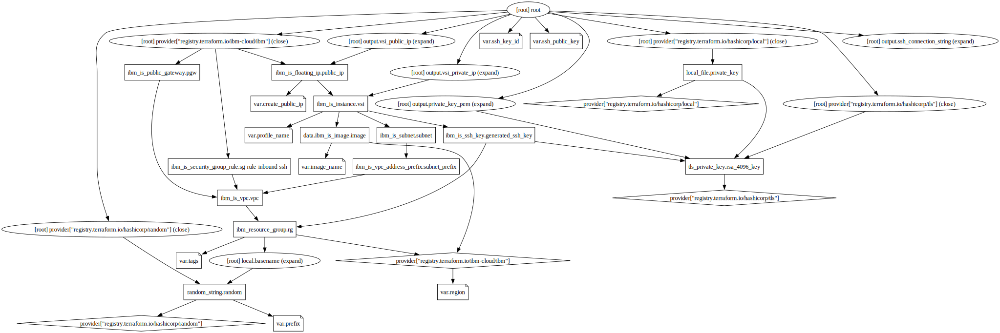

# Learn terraform on IBM Cloud

> Estimated duration: 30 mins

This lab will teach how to use Terraform in IBM Cloud and provision the following Cloud Services:

* a Resource Group
* a VPC
* a Subnet
* a SSH Key
* a VSI (Virtual Server Instance)
* a Floating IP

You can then ssh into the newly created VSI.

| Terraform | Estimation Duration |
| --------- | --------- |
| Apply     | ~2 mins |
| Destroy   | ~3 mins |

## Before you begin

This lab requires the following command lines:

* [IBM Cloud CLI](https://github.com/IBM-Cloud/ibm-cloud-cli-release/releases)
* [Terraform CLI](https://developer.hashicorp.com/terraform/downloads)
* [git](https://git-scm.com/book/en/v2/Getting-Started-Installing-Git)

> Unless you are Administrator of the Cloud Account, you need permissions to be able to provision VPC Resources. Ask the Administrator run the Terraform in `iam` folder.

## Lab

1. Clone this repository

    ```sh
    git clone https://github.com/lionelmace/learn-ibm-terraform
    ```

1. Login to IBM Cloud

    ```sh
    ibmcloud login
    ```

1. Create an IBM Cloud API either in the [console](https://cloud.ibm.com/iam/apikeys) or using the CLI

    ```sh
    ibmcloud iam api-key-create my-api-key
    ```

    > Make sure to preserve the API Key.

1. Export API credential tokens as environment variables

    ```sh
    export IBMCLOUD_API_KEY="Your IBM Cloud API Key Value"
    ```

    > If the variable "ibmcloud_api_key" is set in your provider,
    > you can initialize it using the following command
    > export TF_VAR_ibmcloud_api_key="Your IBM Cloud API Key"

1. Terraform must initialize the provider before it can be used.

    ```sh
    terraform init
    ```

1. Review the plan

    ```sh
    terraform plan
    ```

1. Start provisioning.

   > Estimated duration: 2 mins

    ```sh
    terraform apply
    ```

    Outputs look like this:

    ```sh
    ssh_connection_string = "ssh -i ./rsakey.pem root@VSI-FLOATING-IP"
    vsi_private_ip = "10.10.10.4"
    vsi_public_ip = "158.177.3.170"
    ```

1. Connect to the VSI

    ```sh
    ssh -i ./rsakey.pem root@PUBLIC_IP
    ```

1. Clean up the resources to avoid cost

    ```sh
    terraform destroy
    ```

## Additional commands

1. Once provisioned, reads and outputs a Terraform state or plan file in a human-readable form.

    ```sh
    terraform show
    ```

1. Terraform graph outputs the visual execution graph of Terraform resources. The graph is outputted in DOT format, which can easily be converted to an image by making use of dot provided by GraphViz:

    ```sh
    terraform graph | dot -Tsvg > graph.svg
    ```

    
